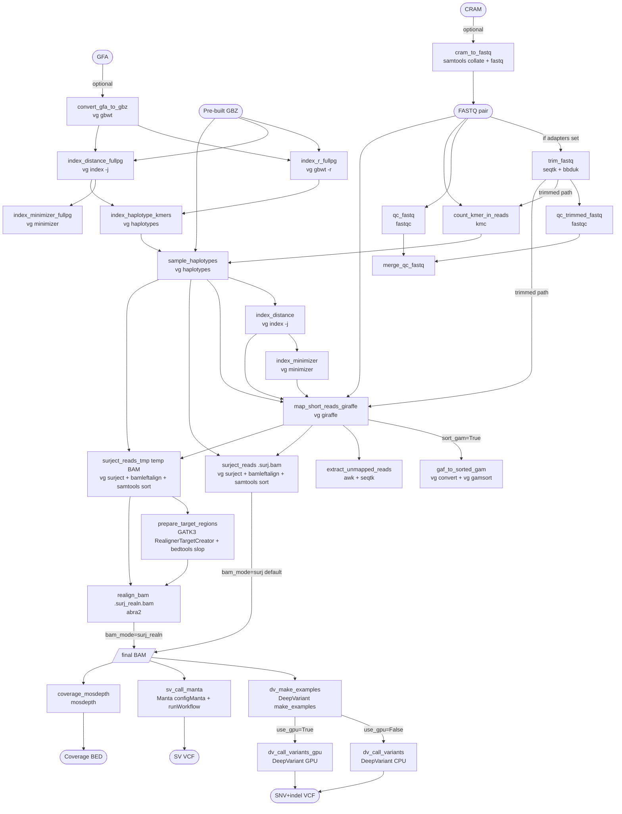

```mermaid
flowchart TD
    GFA([GFA]) -->|optional| cvt[convert_gfa_to_gbz\nvg gbwt]
    GBZ([Pre-built GBZ]) --> ri[index_r_fullpg\nvg gbwt -r]
    cvt --> ri
    cvt --> dist_pg[index_distance_fullpg\nvg index -j]
    GBZ --> dist_pg
    dist_pg --> min_pg[index_minimizer_fullpg\nvg minimizer]
    dist_pg --> hapl[index_haplotype_kmers\nvg haplotypes]
    ri --> hapl

    CRAM([CRAM]) -->|optional| cram2fq[cram_to_fastq\nsamtools collate + fastq]
    cram2fq --> FQ
    FQ([FASTQ pair]) -->|if adapters set| trim[trim_fastq\nseqtk + bbduk]
    FQ --> qc[qc_fastq\nfastqc]
    trim --> qc_t[qc_trimmed_fastq\nfastqc]
    qc & qc_t --> mqc[merge_qc_fastq]

    FQ --> kmer[count_kmer_in_reads\nkmc]
    trim -->|trimmed path| kmer
    hapl --> samp[sample_haplotypes\nvg haplotypes]
    kmer --> samp
    GBZ --> samp
    samp --> idist[index_distance\nvg index -j]
    idist --> imin[index_minimizer\nvg minimizer]
    samp & idist & imin --> giraffe[map_short_reads_giraffe\nvg giraffe]
    FQ --> giraffe
    trim -->|trimmed path| giraffe

    giraffe -->|sort_gam=True| gam[gaf_to_sorted_gam\nvg convert + vg gamsort]
    giraffe --> unmapped[extract_unmapped_reads\nawk + seqtk]

    giraffe --> surj[surject_reads .surj.bam\nvg surject + bamleftalign + samtools sort]
    giraffe --> surj_tmp[surject_reads_tmp temp BAM\nvg surject + bamleftalign + samtools sort]
    samp --> surj & surj_tmp
    surj_tmp --> prep[prepare_target_regions\nGATK3 RealignerTargetCreator + bedtools slop]
    surj_tmp --> abra[realign_bam .surj_realn.bam\nabra2]
    prep --> abra

    surj -->|bam_mode=surj default| BAM[/final BAM/]
    abra -->|bam_mode=surj_realn| BAM

    BAM --> mkex[dv_make_examples\nDeepVariant make_examples]
    mkex -->|use_gpu=False| dv[dv_call_variants\nDeepVariant CPU]
    mkex -->|use_gpu=True| dvg[dv_call_variants_gpu\nDeepVariant GPU]
    BAM --> manta[sv_call_manta\nManta configManta + runWorkflow]
    BAM --> mosd[coverage_mosdepth\nmosdepth]

    dv & dvg --> SNV([SNV+indel VCF])
    manta --> SV([SV VCF])
    mosd --> COV([Coverage BED])
```
